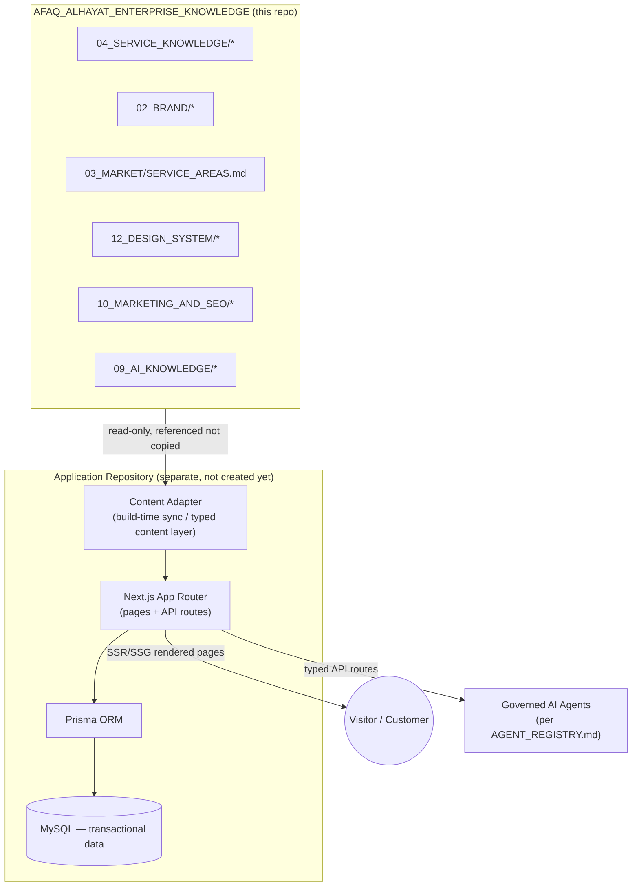

# Application Architecture

## Document Information

- **Owner:** Business Owner
- **Status:** Draft — planning only, no code or infrastructure created by this document
- **Version:** 1.0
- **Prepared:** 2026-07-27
- **Scope:** `07_WEBSITE/IMPLEMENTATION/` — the production implementation roadmap for the approved canonical stack
- **Depends on:** `00_GOVERNANCE/05_TECHNOLOGY_FINAL_DECISION.md`, `00_GOVERNANCE/TECH_STACK.md`, `00_GOVERNANCE/IMPLEMENTATION_READINESS_REPORT.md`, `08_DIGITAL_SYSTEMS/DATA_MODEL.md`, `08_DIGITAL_SYSTEMS/API_CONTRACTS.md`

## Note on scope and location

This document and its five companions (`02`–`06` in this folder) describe architecture and sequencing only. No application repository, package manifest, dependency, or line of application code is created here. Per `PROJECT_MANIFEST.md` ("Out of Scope: Source code implementation") and `CLAUDE.md`, the actual Next.js codebase must **not** live inside this knowledge repository — it belongs in a separate application repository that *consumes* this repository's governed facts. This plan prepares for that separate repository; it does not create it.

`07_WEBSITE/IMPLEMENTATION/` is a new folder relative to the target tree documented in `SYSTEM_ARCHITECTURE.md` §4 (which lists `07_WEBSITE/{01_HOMEPAGE…09_ERROR_PAGES,WORDPRESS}` without an `IMPLEMENTATION/` entry). It fits the domain's existing responsibility ("channel architecture, page composition, UI content mapping," per §5) and duplicates no owned fact — but its addition to the canonical target tree is noted here for the record, not silently assumed; a future architecture-document update can register it if the Owner agrees.

---

## 1. Governing Principles (carried from existing governance, not reinvented)

1. **Knowledge is the source of truth; the application is a consumer.** Every business fact (service, price, contact detail, coverage area) is read by reference from this repository's canonical documents. The application never hard-codes or forks a fact — per `SYSTEM_ARCHITECTURE.md` §7.
2. **Blocked-field pattern.** Any fact still `Pending`/`Draft` in its owning source (WhatsApp, email, hours, address, pricing, warranty terms) must render as an explicit absent/blocked UI state, never a placeholder value or invented default.
3. **Approval-gated writes.** Any transactional write with commercial, legal, or safety weight (booking confirmation, quote, work order) follows the `Approval` entity and `AUTONOMY_AND_APPROVAL_MATRIX.md` — the data model already requires an `Approval` record matching the exact action instance (`08_DIGITAL_SYSTEMS/DATA_MODEL.md`).
4. **Design tokens, not page-level invention.** All visual decisions trace to `12_DESIGN_SYSTEM/*` and the binding `LUXURY_DESIGN_DIRECTION.md` — components do not introduce ad hoc colors, spacing, or type sizes.
5. **Bilingual parity.** Arabic (primary, RTL) and English (LTR) are equal, parallel products sharing one data layer — never diverging facts, never a "translated afterthought."
6. **Agent-operable by design.** Per the repo's own Agent Operating System (`00_GOVERNANCE/AGENT_REGISTRY.md`, `08_DIGITAL_SYSTEMS/AUTOMATION/AGENT_ORCHESTRATION.md`), API routes and data contracts should be structured so governed AI agents can read/act through typed, permissioned endpoints rather than scripting around a UI.

---

## 2. High-Level Architecture

- **Content data** (service facts, brand facts, coverage, design tokens, SEO/AI policy) is authored once in this knowledge repository and pulled into the application through a content adapter — never retyped by hand into components.
- **Transactional data** (customers, contact points, consent, enquiries, booking requests, quote requests, work orders, approvals, interactions, audit events) lives in MySQL via Prisma, modeled exactly on the entities already approved in `08_DIGITAL_SYSTEMS/DATA_MODEL.md` v0.2 — this plan does not invent a new data model, it implements the existing one.

---

## 3. Rendering Strategy

| Page type | Strategy | Rationale |
|---|---|---|
| Homepage, Service pages, Location pages (emirate-level), Blog, About, Legal, Error pages | Static Generation (SSG) with Incremental Static Regeneration (ISR) | Content changes infrequently, benefits from Next.js's SEO/speed strengths identified in `05_TECHNOLOGY_FINAL_DECISION.md` §2.3. |
| Booking flow, Contact form submission | Server-rendered / API-route driven, no static caching | Reflects live availability and writes to MySQL through Prisma. |
| Customer Portal, future Admin/Technician portals | Authenticated, server-rendered (dynamic) | Requires session/auth context; out of static-generation scope. |

Every page-type decision above still passes through the same blocked-field and approval-gate rules in Section 1 — rendering strategy is a performance choice, not a governance exception.

---

## 4. Bilingual Routing

- Arabic (default/primary) and English served from parallel locale-prefixed routes (e.g., `/ar/...`, `/en/...`), sharing one content adapter and one data layer.
- `dir="rtl"` / `dir="ltr"` applied per locale at the layout root, per `12_DESIGN_SYSTEM/TYPOGRAPHY.md`'s bidirectional-handling rules.
- No page may exist in one language without its approved counterpart expressing the same facts — enforced as a content-integration check (see `04_CONTENT_INTEGRATION_PLAN.md`), not left to manual review alone.

---

## 5. Authentication and Customer Login (forward-looking, not decided here)

`08_DIGITAL_SYSTEMS/CRM_AND_PORTALS.md` and the Customer Portal scope anticipate customer login, but no authentication provider, session strategy, or identity-verification method has been chosen in governance yet. This plan flags it as an open technical decision for Phase 3 (system integration) — **not** something this document decides. Candidate approaches (credential-based, OTP/phone-based given the approved phone channel, or a managed auth provider) should be evaluated against `99_STANDARDS/SECURITY_STANDARD.md` before selection.

---

## 6. Known Cross-Document Conflict to Resolve Before Token Lock

While reviewing `12_DESIGN_SYSTEM/COLORS.md` (Approved Design Standard) against `02_BRAND/BRAND_COLORS.md` (Brand asset document), the following values disagree:

| Token | `12_DESIGN_SYSTEM/COLORS.md` | `02_BRAND/BRAND_COLORS.md` |
|---|---|---|
| Info | `#0EA5E9` | `#2563EB` |
| Success | `#16A34A` (labeled "Success Green") | `#22C55E` (separate "Status → Success," while `#16A34A` is labeled "Secondary/CTA") |
| Secondary background | `#F8FAFC` | `#F5F7FA` |
| Accent | Not present | Gold `#D4AF37` for "Premium Elements, Awards, Badges" |

`LUXURY_DESIGN_DIRECTION.md` (an approved, binding standard) explicitly states *"The approved tokens in `COLORS.md` remain the source of truth"* and separately prohibits *"decorative gold gradients... unapproved accent palettes"* — which reads as resolving this in favor of `12_DESIGN_SYSTEM/COLORS.md` for digital-product implementation, with the Gold accent treated as a print/brand-asset value not carried into the UI.

**This plan follows that reading** (`12_DESIGN_SYSTEM/COLORS.md` values become the Tailwind color tokens) but flags the underlying document conflict rather than silently erasing it — per this repository's non-duplication and no-silent-resolution rules, the Owner should confirm this interpretation or reconcile the two source documents before tokens are locked into code.

---

## 7. Environments

| Environment | Purpose | Data | Gate |
|---|---|---|---|
| Local | Development | Local/test MySQL, no real customer data | None — developer machine |
| CI (GitHub Actions) | Lint, type-check, automated tests | Ephemeral test data | Must pass before merge |
| Staging | Pre-production validation | Test-mode data only | Confirm Hostinger staging capability (open gate, see `06_DEPLOYMENT_PLAN.md`) |
| Production | Live site | Real customer data, once approved | `A4` — explicit Owner approval per `IMPLEMENTATION_READINESS_REPORT.md` |

---

## 8. What This Document Does Not Do

- It does not create the application repository, install any dependency, or write any TypeScript/React/Prisma code.
- It does not resolve the color-token conflict in Section 6 — it surfaces it for Owner decision.
- It does not choose an authentication provider for customer login.
- It does not authorize production deployment, DNS changes, or credential provisioning.

---

## Related Documents

- `02_FOLDER_STRUCTURE.md`
- `03_COMPONENT_STRATEGY.md`
- `04_CONTENT_INTEGRATION_PLAN.md`
- `05_SEO_IMPLEMENTATION_PLAN.md`
- `06_DEPLOYMENT_PLAN.md`
- `00_GOVERNANCE/05_TECHNOLOGY_FINAL_DECISION.md`
- `08_DIGITAL_SYSTEMS/DATA_MODEL.md`
