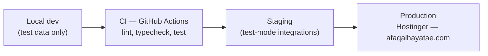

# Deployment Plan

## Document Information

- **Owner:** Business Owner
- **Status:** Draft — planning only, no infrastructure provisioned by this document
- **Version:** 1.0
- **Prepared:** 2026-07-27
- **Depends on:** `00_GOVERNANCE/TECH_STACK.md`, `00_GOVERNANCE/IMPLEMENTATION_READINESS_REPORT.md`, `00_GOVERNANCE/AUTONOMY_AND_APPROVAL_MATRIX.md`, `02_WEBSITE_IMPLEMENTATION_PLAN.md` §5

## Note on scope

This document sequences deployment; it does not perform any deployment action, provision any credential, or change any DNS/hosting configuration. Every irreversible or externally-visible action named below remains `A4` — explicit Owner approval required at the time it actually happens, not implied by this plan.

---

## 1. Confirmed Facts to Build On

| Fact | Source | Status |
|---|---|---|
| Hosting provider | Hostinger | Confirmed by Owner, 2026-07-23 |
| Next.js, Node.js, MySQL supported on current plan | `DECISION_LOG.md` decision 34 | Verified 2026-07-26 |
| PostgreSQL not available | Same | Confirmed — MySQL is canonical |
| Domain | `afaqalhayatae.com` | Confirmed |

## 2. Still-Open Deployment Gates (not resolved by this document)

- Exact deployment method on Hostinger (Node app hosting vs. container vs. another supported runtime path).
- Staging environment availability and its capabilities.
- SSH/CI access and deployment credentials.
- Backup cadence, retention, and region.
- Apex (`afaqalhayatae.com`) vs. `www` canonical redirect configuration.

These require direct technical verification against the specific Hostinger plan before Phase 4 (Controlled Launch) can begin — listed here as prerequisites, not assumed answers.

---

## 3. Environment Pipeline

| Stage | Data | Credentials | Gate to advance |
|---|---|---|---|
| Local | Local/test MySQL | None real | Passes local build |
| CI | Ephemeral | None | All automated checks green |
| Staging | Test-mode only (per `IMPLEMENTATION_READINESS_REPORT.md`) | Non-production only | Manual QA pass + Owner review of any customer-facing change |
| Production | Real | Production, provisioned only at this stage | Explicit Owner `A4` approval, every time |

---

## 4. Database Migration Strategy

- Prisma migrations are authored and applied first against local/CI/staging MySQL instances only.
- `prisma/schema.prisma` mirrors `08_DIGITAL_SYSTEMS/DATA_MODEL.md` v0.2 exactly — any schema change beyond that approved model requires a governance update to `DATA_MODEL.md` first, not a schema drift silently introduced in code.
- Production migration is treated as a hosting/data change under `AUTONOMY_AND_APPROVAL_MATRIX.md` — `A4`, requiring explicit per-instance Owner approval, with a rollback plan (down-migration or restore point) confirmed before it runs.

---

## 5. Secrets and Credentials

- No production credential, API key, or connection string is stored in either repository.
- Environment variables only, managed outside version control (`.env` files gitignored, secrets injected at deploy time).
- Per `IMPLEMENTATION_READINESS_REPORT.md`, Phase 1 scaffolding uses no production secrets at all — local/test credentials only until the Owner authorizes moving to staging/production.

---

## 6. Rollback Strategy

Mirrors this knowledge repository's own non-destructive posture (`SYSTEM_ARCHITECTURE.md` §14):

- Application deployments roll back via redeploying the previous known-good build/commit, never a forced history rewrite.
- Database rollback uses a reviewed down-migration or a verified backup restore — never an untested destructive operation against production data.
- No `git push --force`, `reset --hard`, or credential/DNS change happens without being named and approved as its own explicit step at the time.

---

## 7. Domain and DNS

- Apex vs. `www` canonicalization is decided and configured only at actual deployment time, per `CONTACT_INFORMATION.md`'s existing note that this remains unresolved.
- Any DNS change is `A4` — hosting/DNS changes are explicitly named as an approval-required category in `AUTONOMY_AND_APPROVAL_MATRIX.md`.

---

## 8. Monitoring

- Error logging and performance monitoring per `TECH_STACK.md` — implemented from Phase 1 (non-production) so the pattern exists before production traffic does, not bolted on after launch.
- Analytics wired in test mode first, per `05_SEO_IMPLEMENTATION_PLAN.md` §7.

---

## 9. Launch Sequencing

Follows the phase structure already set in `00_GOVERNANCE/02_WEBSITE_IMPLEMENTATION_PLAN.md` §4 and the priority order in `00_GOVERNANCE/CURRENT_PROJECT_STATUS.md` — restated here only as the deployment-specific checkpoints, not a new sequence:

1. Verify the exact Hostinger deployment method and staging capability (closes the open gates in Section 2).
2. Deploy Phase 1 scaffolding to a non-production environment; confirm CI passes.
3. Deploy content-gated pages (Homepage, Pest Control service page, 7 emirate location pages) to staging; run the SEO and design acceptance gates.
4. Owner reviews staging; explicitly authorizes first production deployment.
5. Launch in controlled stages (initial page set only), monitor, then expand as remaining services/locations/features clear their own content and commercial gates.

---

## What This Document Does Not Do

- It does not provision any server, database, or DNS record.
- It does not create any credential or secret.
- It does not authorize production deployment — that authorization happens explicitly, at the time, separate from this plan.

---

## Related Documents

- `00_GOVERNANCE/02_WEBSITE_IMPLEMENTATION_PLAN.md`
- `00_GOVERNANCE/IMPLEMENTATION_READINESS_REPORT.md`
- `00_GOVERNANCE/AUTONOMY_AND_APPROVAL_MATRIX.md`
- `01_APPLICATION_ARCHITECTURE.md`
