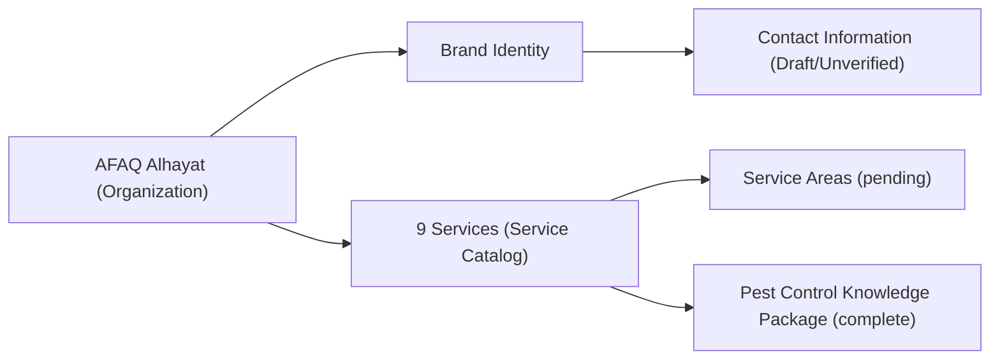

# Entity Relationships

## Purpose

How the entities in `ENTITY_REGISTRY.md` relate to each other, mirroring the domain relationship diagram already defined in `SYSTEM_ARCHITECTURE.md` Sec. 9.

---

# Relationships

---

# Notes

- The organization has exactly one brand identity and one canonical contact-information document — never more than one per the Single Source of Truth rule.
- Each service will eventually have exactly one knowledge package; currently only Pest Control does.
- Service availability by area cannot be asserted until `SERVICE_AREAS.md` is finalized.

---

# Status

Draft — derived from existing domain relationships in `SYSTEM_ARCHITECTURE.md`; extend as new entities are formally added.
