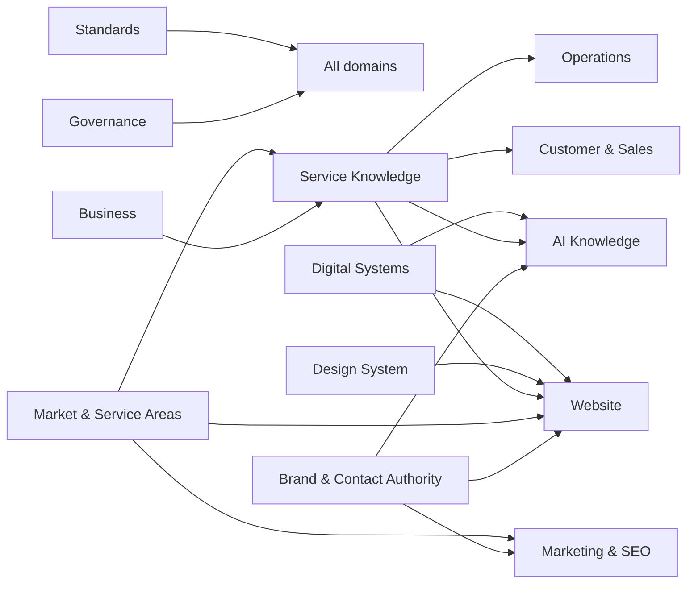

# AFAQ Alhayat Enterprise Knowledge System Architecture

> **Status:** Approved — Structural Architecture Authority (Migration Complete; Repository Stabilized)  
> **Version:** 1.1  
> **Prepared:** 2026-07-23  
> **Updated:** 2026-07-24  
> **Authority:** Subordinate to the Business Owner and the Enterprise Constitution  
> **Migration mode:** Complete — this document governs ongoing structural and architectural decisions  
> **Applies to:** `AFAQ_ALHAYAT_ENTERPRISE_KNOWLEDGE`

---

## 1. Purpose

This document is the architectural constitution for the AFAQ Alhayat Enterprise Knowledge System. It defines the final repository structure, ownership boundaries, authoritative sources, naming and non-duplication rules, cross-domain relationships, and the controls required for a safe migration.

The repository is a knowledge system first. The website, AI assistants, CRM, marketing channels, operational teams, and future applications are consumers of governed knowledge; none of them should become an uncontrolled duplicate source.

This document does **not** authorize immediate restructuring. It defines the target state and the process by which a separate, explicitly approved migration may reach it.

---

## 2. Review of the current project

The project was reviewed read-only at:

`/Users/ashrafeladrousi/Documents/AFAQ_ALHAYAT_ENTERPRISE_KNOWLEDGE`

### 2.1 Confirmed strengths

- The repository already contains substantial business, brand, market, design-system, WordPress, homepage, service, operational, safety, training, bilingual, SEO, and AI knowledge.
- `PROJECT_MANIFEST.md` already establishes knowledge-first, bilingual, AI-native, modular, and single-source-of-truth principles.
- The Pest Control package has a useful domain split: business, operations, safety, customer guidance, FAQ, SEO/AI, Arabic and English content, training, media, and changelog.
- Naming and reusable service-template documents already exist and should be preserved as inputs to the final standards.

### 2.2 Confirmed structural risks

- Brand and market files currently exist under `00_START/TEMP/01_BRAND/02_MARKET`.
- A second brand body exists under `00_START/01_BUSINESS/02_BRAND`.
- Market research and service knowledge are nested under the brand tree.
- `03_SERVICE_KNOWLEDGE` currently sits inside `07_WEBSITE/03_SERVICES`, although service knowledge should be independent of the website.
- Project-wide standards currently sit inside `07_WEBSITE/01_HOMEPAGE/99_STANDARDS`.
- The repository contains empty Markdown files, including the root `README.md`, `TARGET_CUSTOMERS.md`, `COMPETITOR_ANALYSIS.md`, and `05_ACCESSIBILITY_STANDARD.md`.
- Contact fields have independent verification states. The phone and domain
  are owner-approved; WhatsApp, email, address, hours, and social URLs remain
  pending. Consumers must never infer one field from another.
- A zero-byte object named `01_HOMEPAGE` exists in the design-system tree and must be classified before migration.
- macOS `.DS_Store` files are present and should be ignored by Git, but not silently deleted during the first migration.
- The project is **not currently a Git repository**. Safe migration therefore requires Git initialization and a baseline commit before any move.

### 2.3 Architectural conclusion

The content is valuable; the main problem is containment and authority, not lack of work. Migration must preserve all content, separate domains, identify conflicts, and introduce explicit authority without deleting legacy material.

---

## 3. Governing principles

1. **Preserve before improving.** Inventory and hash every file before any mutation.
2. **Analyze before acting.** The first agent pass is report-only.
3. **One fact, one authority.** Reuse facts by reference; do not copy them between domains.
4. **Domains own knowledge; channels consume it.** Website and AI documents describe presentation and consumption, not master business facts.
5. **Bilingual by design.** Arabic and English are first-class, paired content variants with shared factual sources.
6. **No silent conflict resolution.** Conflicting facts are reported for human approval.
7. **No deletion during migration.** Superseded or unclear files go to a legacy archive with a manifest.
8. **No overwrite during migration.** A destination collision must stop that item and enter the conflict report.
9. **Traceability is mandatory.** Every proposed and completed move must have old path, new path, reason, checksum, and status.
10. **Small reversible batches.** Each approved phase ends with verification and a Git commit.

---

## 4. Final target structure

```text
AFAQ_ALHAYAT_ENTERPRISE_KNOWLEDGE/
├── README.md
├── PROJECT_MANIFEST.md
├── SYSTEM_ARCHITECTURE.md
├── CLAUDE_MIGRATION_PROMPT.md
├── .gitignore
│
├── 00_GOVERNANCE/
│   ├── PROJECT_OVERVIEW.md
│   ├── PROJECT_SCOPE.md
│   ├── PROJECT_GOALS.md
│   ├── PROJECT_ROADMAP.md
│   ├── TECH_STACK.md
│   ├── GLOSSARY.md
│   ├── DECISION_LOG.md
│   └── MIGRATION/
│       ├── CURRENT_STATE_INVENTORY.md
│       ├── DUPLICATE_AND_CONFLICT_REPORT.md
│       ├── MIGRATION_PLAN.md
│       ├── MIGRATION_MAP.csv
│       └── VALIDATION_REPORT.md
│
├── 01_BUSINESS/
│   ├── COMPANY_PROFILE.md
│   ├── VISION.md
│   ├── MISSION.md
│   ├── BUSINESS_MODEL.md
│   ├── BUSINESS_GOALS.md
│   ├── TARGET_AUDIENCE.md
│   ├── SWOT_ANALYSIS.md
│   └── STAKEHOLDERS.md
│
├── 02_BRAND/
│   ├── CONTACT_INFORMATION.md
│   ├── LOCAL_SEO_PROFILE.md
│   ├── BRAND_IDENTITY.md
│   ├── BRAND_COLORS.md
│   ├── TYPOGRAPHY.md
│   ├── LOGO_GUIDELINES.md
│   ├── BRAND_VOICE.md
│   ├── ICONOGRAPHY.md
│   ├── BRAND_IMAGES.md
│   ├── BRAND_APPLICATIONS.md
│   ├── BRAND_GUIDELINES.md
│   └── BRAND_CHECKLIST.md
│
├── 03_MARKET/
│   ├── MARKET_OVERVIEW.md
│   ├── UAE_MARKET_ANALYSIS.md
│   ├── CUSTOMER_ANALYSIS.md
│   ├── TARGET_CUSTOMERS.md
│   ├── COMPETITOR_ANALYSIS.md
│   ├── MARKET_TRENDS.md
│   ├── MARKET_OPPORTUNITIES.md
│   ├── MARKET_RISKS.md
│   ├── MARKET_STRATEGY.md
│   └── SERVICE_AREAS.md
│
├── 04_SERVICE_KNOWLEDGE/
│   ├── README.md
│   ├── SERVICE_CATALOG.md
│   ├── SERVICE_MATRIX.md
│   ├── SERVICE_WORKFLOW.md
│   ├── SERVICE_KPIS.md
│   ├── SERVICE_GLOSSARY.md
│   └── 01_PEST_CONTROL/
│       ├── README.md
│       ├── BUSINESS.md
│       ├── OPERATIONS.md
│       ├── SAFETY.md
│       ├── CUSTOMER_GUIDE.md
│       ├── FAQ.md
│       ├── SEO_AI.md
│       ├── CONTENT_AR.md
│       ├── CONTENT_EN.md
│       ├── TRAINING.md
│       ├── MEDIA.md
│       └── CHANGELOG.md
│
├── 05_OPERATIONS/
│   ├── SOP/
│   ├── QUALITY/
│   ├── SAFETY/
│   ├── FORMS/
│   ├── CHECKLISTS/
│   ├── INCIDENTS/
│   └── BUSINESS_CONTINUITY/
│
├── 06_CUSTOMER_AND_SALES/
│   ├── BOOKING/
│   ├── CUSTOMER_JOURNEYS/
│   ├── SALES/
│   ├── CUSTOMER_SUPPORT/
│   ├── PRICING/
│   ├── WARRANTY/
│   └── POLICIES/
│
├── 07_WEBSITE/
│   ├── README.md
│   ├── 01_HOMEPAGE/
│   ├── 02_ABOUT/
│   ├── 03_SERVICE_PAGES/
│   ├── 04_LOCATIONS/
│   ├── 05_BOOKING/
│   ├── 06_BLOG/
│   ├── 07_CONTACT/
│   ├── 08_LEGAL_PAGES/
│   ├── 09_ERROR_PAGES/
│   └── WORDPRESS/
│
├── 08_DIGITAL_SYSTEMS/
│   ├── CRM/
│   ├── CUSTOMER_PORTAL/
│   ├── ADMIN/
│   ├── API/
│   ├── DATABASE/
│   ├── INTEGRATIONS/
│   └── AUTOMATION/
│
├── 09_AI_KNOWLEDGE/
│   ├── README.md
│   ├── KNOWLEDGE_INDEX.md
│   ├── ENTITY_REGISTRY.md
│   ├── ENTITY_RELATIONSHIPS.md
│   ├── AI_SYSTEM_PROMPT.md
│   ├── RETRIEVAL_POLICY.md
│   ├── ANSWER_POLICY.md
│   ├── GEO_STRATEGY.md
│   └── EVALUATIONS/
│
├── 10_MARKETING_AND_SEO/
│   ├── SEO_STRATEGY.md
│   ├── LOCAL_SEO.md
│   ├── CONTENT_STRATEGY.md
│   ├── SCHEMA_STRATEGY.md
│   ├── KNOWLEDGE_GRAPH.md
│   ├── ANALYTICS.md
│   ├── CAMPAIGNS/
│   └── SOCIAL_MEDIA/
│
├── 11_TECHNICAL/
│   ├── ARCHITECTURE/
│   ├── SECURITY/
│   ├── TESTING/
│   ├── DEPLOYMENT/
│   ├── MONITORING/
│   └── DISASTER_RECOVERY/
│
├── 12_DESIGN_SYSTEM/
│   ├── README.md
│   ├── COLORS.md
│   ├── TYPOGRAPHY.md
│   ├── SPACING.md
│   ├── GRID.md
│   ├── BUTTONS.md
│   ├── FORMS.md
│   ├── CARDS.md
│   ├── ICONS.md
│   ├── COMPONENTS.md
│   ├── MOBILE.md
│   ├── ACCESSIBILITY.md
│   └── ANIMATIONS.md
│
├── 98_LEGACY_ARCHIVE/
│   ├── README.md
│   ├── ARCHIVE_MANIFEST.csv
│   └── YYYY-MM-DD_PRE_MIGRATION/
│
└── 99_STANDARDS/
    ├── README.md
    ├── PROJECT_STANDARDS.md
    ├── DOCUMENTATION_STANDARD.md
    ├── NAMING_CONVENTIONS.md
    ├── SERVICE_TEMPLATE.md
    ├── UI_UX_STANDARD.md
    ├── SEO_STANDARD.md
    ├── AI_GEO_STANDARD.md
    ├── ACCESSIBILITY_STANDARD.md
    ├── PERFORMANCE_STANDARD.md
    ├── SECURITY_STANDARD.md
    └── QUALITY_CHECKLIST.md
```

Only confirmed content should be migrated. Empty target directories may be created only when the approved migration plan explicitly calls for them.

---

## 5. Responsibility of each top-level folder

| Folder | Responsibility | Must not own |
|---|---|---|
| `00_GOVERNANCE` | Project direction, decisions, scope, roadmap, migration evidence | Brand facts, service procedures, page copy |
| `01_BUSINESS` | Company identity as a business, model, audience, goals and stakeholders | Visual brand rules, contact channels |
| `02_BRAND` | Official names, contact/NAP data, brand identity and expression | Market analysis, page-specific copy |
| `03_MARKET` | Geography, audiences, competitors, trends and opportunity evidence | Official phone/email, operational SOPs |
| `04_SERVICE_KNOWLEDGE` | Authoritative service definitions and service-specific knowledge | Website layout, global contact facts |
| `05_OPERATIONS` | Cross-service SOPs, QA, HSE, forms and continuity | Marketing copy, page architecture |
| `06_CUSTOMER_AND_SALES` | Booking, sales, pricing, warranty and support policies | Service technical facts owned elsewhere |
| `07_WEBSITE` | Channel architecture, page composition, UI content mapping and CMS rules | Master service/contact/market facts |
| `08_DIGITAL_SYSTEMS` | CRM, portal, admin, API, data and automation specifications | Human-facing master content |
| `09_AI_KNOWLEDGE` | Retrieval, entities, AI policies, evaluations and knowledge indexing | Invented business facts or duplicated source content |
| `10_MARKETING_AND_SEO` | Cross-channel acquisition, SEO, schema, analytics and campaigns | NAP authority or service operational truth |
| `11_TECHNICAL` | Technical architecture, security, testing, deployment and monitoring | Business policy ownership |
| `12_DESIGN_SYSTEM` | Shared visual and interaction primitives | Page-specific content or business facts |
| `98_LEGACY_ARCHIVE` | Immutable preservation of superseded, ambiguous or unclassified material | Active authoritative documents |
| `99_STANDARDS` | Rules and reusable templates applied across the repository | Page or service instances |

---

## 6. Source-of-truth registry

| Data type | Authoritative source | Consumers |
|---|---|---|
| Project purpose, scope and governance | `PROJECT_MANIFEST.md`, `00_GOVERNANCE/*` | All domains and agents |
| Official company name and business description | `01_BUSINESS/COMPANY_PROFILE.md` | Brand, website, AI, CRM, marketing |
| Phone, WhatsApp, email, domain, address, working hours and social URLs | `02_BRAND/CONTACT_INFORMATION.md` | Website, schema, AI, campaigns, customer support |
| NAP, branch IDs, map coordinates and business-profile URLs | `02_BRAND/LOCAL_SEO_PROFILE.md` | Local SEO, schema, location pages, AI |
| Brand voice, colors, logo and identity | `02_BRAND/*` | Website, marketing, media and AI generation |
| Emirates, cities, districts and coverage status | `03_MARKET/SERVICE_AREAS.md` | Service matrix, local pages, booking and AI |
| Target audiences and market evidence | `03_MARKET/*` | Business, service positioning, marketing |
| Official service catalog and identifiers | `04_SERVICE_KNOWLEDGE/SERVICE_CATALOG.md` | Website, CRM, booking, AI, analytics |
| Service-specific factual and operational knowledge | `04_SERVICE_KNOWLEDGE/<SERVICE>/*` | Website, sales, support, training and AI |
| Shared SOP, quality and safety rules | `05_OPERATIONS/*` | Service packages, employees, training, audits |
| Prices, packages, booking, warranty and commercial policies | `06_CUSTOMER_AND_SALES/*` | Website, CRM, support and proposals |
| Page order, presentation and channel-specific copy mapping | `07_WEBSITE/*` | Website implementation only |
| Data models, APIs and system behavior | `08_DIGITAL_SYSTEMS/*` | Developers, integrations and automation |
| AI entity registry and retrieval policy | `09_AI_KNOWLEDGE/*` | AI assistants and knowledge pipelines |
| Global SEO and schema policy | `10_MARKETING_AND_SEO/*` and `99_STANDARDS/*` | All public channels |
| Design tokens and reusable UI behavior | `12_DESIGN_SYSTEM/*` | Website, portals, admin and apps |
| Naming, documentation and quality requirements | `99_STANDARDS/*` | Entire repository |

No consumer may silently redefine a fact owned by another source. A consumer should link to the source and add only channel-specific instructions.

---

## 7. Non-duplication rules

1. Official contact data appears only in `CONTACT_INFORMATION.md`; other files reference it.
2. Geographic coverage appears only in `SERVICE_AREAS.md`; service pages select applicable area IDs rather than copying lists.
3. The service catalog assigns one stable ID and official bilingual name per service.
4. Operational facts belong in service or operations knowledge, not homepage or marketing documents.
5. Website documents specify placement, CTA role, and source references; they do not become master copies of service facts.
6. AI documents define retrieval and interpretation; they do not invent or fork source facts.
7. Global standards live only under root `99_STANDARDS`.
8. Bilingual content pairs must express equivalent approved facts. Language-specific phrasing is allowed; factual divergence is not.
9. If two existing documents overlap, neither is deleted automatically. The migration report identifies a proposed canonical file and archives the other after approval.
10. Generated pages or exports are build artifacts, not authoritative source documents, and should be reproducible from governed knowledge.

### Reference format

Use relative Markdown links for human navigation and stable identifiers for automation. Example:

```md
Contact data: [CONTACT_INFORMATION.md](02_BRAND/CONTACT_INFORMATION.md)
Service area source: `03_MARKET/SERVICE_AREAS.md` (approved at emirate level;
lower-level areas require explicit registry rows)
Service ID: SVC-PEST-CONTROL
```

---

## 8. Naming rules

### 8.1 Folders and Markdown files

- Use English names.
- Top-level folders use a two-digit order prefix plus `UPPER_SNAKE_CASE`.
- Domain folders use `UPPER_SNAKE_CASE`.
- Markdown files use `UPPER_SNAKE_CASE.md`, except conventional `README.md` and `CHANGELOG.md`.
- Avoid spaces, ambiguous abbreviations, and duplicate numeric prefixes at different semantic levels.
- A file name describes its owned subject, not its current UI location.

### 8.2 Stable identifiers

- Services: `SVC-<NAME>`, for example `SVC-PEST-CONTROL`.
- Locations: `LOC-AE-<EMIRATE>-<AREA>`, for example `LOC-AE-DU-DUBAI-MARINA`.
- Components: `CMP-###` plus a PascalCase implementation name.
- Architecture decisions: `ADR-####`.
- Forms: `FORM-<DOMAIN>-###`.
- SOPs: `SOP-<DOMAIN>-###`.

### 8.3 Code and asset conventions

- Database tables and fields: `snake_case`.
- API resource paths: lowercase plural nouns with versioned base, such as `/api/v1/services`.
- UI components: `PascalCase`.
- CSS classes: `kebab-case`.
- Media: `<service-or-domain>-<purpose>-<locale?>-v<number>.<ext>`.
- Dates: ISO `YYYY-MM-DD`.
- Document versions: semantic `vMAJOR.MINOR`.
- Status values: `Draft`, `In Review`, `Approved`, `Deprecated`, `Archived`.

### 8.4 Metadata minimum

Every authoritative document should declare:

- Title
- Owner
- Status
- Version
- Last reviewed date
- Language or language relationship
- Related sources

Metadata may be added in a later content-governance phase; migration must not fabricate owners or approval states.

---

## 9. Domain relationships



### 9.1 Brand to downstream channels

The brand domain owns official identity and contact records. Website CTAs, local schema, AI answers, and campaigns retrieve these values. They must not hard-code alternate phone numbers or business names.

### 9.2 Market to services and locations

The market domain owns the geographic taxonomy and coverage status. A service-to-location availability matrix belongs in service knowledge and references market location IDs. Local landing pages are website/SEO projections of that matrix, not new authorities.

### 9.3 Services to website

Service packages own what a service is, who it serves, how it operates, safety rules, FAQs, and approved bilingual master content. Website service pages own layout, user journey, CTA placement, and presentation mapping.

### 9.4 Services to AI

AI uses indexed service facts, FAQs, customer guides, and approved policies. AI answer policy must cite authoritative paths, disclose uncertainty, and refuse to fill missing phone, price, warranty, licensing, or safety facts.

### 9.5 Standards and design system

Standards are normative rules. The design system is a reusable implementation vocabulary. Neither should be nested under one page or one service.

---

## 10. Safe migration policy

### 10.1 Mandatory phases

1. **Discovery — read-only**
   - Inventory every object, including hidden and zero-byte files.
   - Record type, size, modified time, and SHA-256 checksum.
   - Detect duplicate names, duplicate hashes, broken links, placeholders, empty files, and path collisions.
   - Produce reports only.

2. **Human approval gate**
   - Present the exact proposed move map.
   - List conflicts and decisions requiring user input.
   - Wait for explicit approval. Silence is not approval.

3. **Baseline protection**
   - Initialize Git if absent.
   - Add a conservative `.gitignore` for `.DS_Store` and temporary editor files.
   - Commit the untouched baseline.
   - Create a dedicated migration branch.
   - Create a baseline tag and external backup/archive if approved.

4. **Staged migration**
   - Create target containers.
   - Move only approved, conflict-free items using Git-aware moves where possible.
   - Preserve unclear or superseded items in `98_LEGACY_ARCHIVE`.
   - Commit after each domain batch.

5. **Validation**
   - Compare before/after inventories and checksums.
   - Verify no source file was lost or overwritten.
   - Check Markdown links, empty documents, placeholders, naming rules, and source-of-truth violations.
   - Produce a final validation report.

6. **Final approval**
   - Do not merge the migration branch until the user approves the validation report.

### 10.2 Prohibited actions

- No `rm`, recursive delete, trash, purge, or destructive cleanup.
- No overwriting destination files.
- No automatic merge of conflicting documents.
- No editing substantive document content during a structural migration.
- No changing real company facts, status, owner, version, phone, email, domain, or service coverage without user confirmation.
- No publishing or indexing placeholder contact data.
- No force push, history rewrite, hard reset, or deletion of the baseline branch/tag.

### 10.3 Collision policy

When two files map to the same target:

1. Stop that item.
2. Compare checksums and content.
3. If byte-identical, keep one active copy and archive the second path with traceability—only after approval.
4. If different, create a conflict record and request a canonical-source decision.
5. Never concatenate or overwrite automatically.

### 10.4 Archive policy

`98_LEGACY_ARCHIVE` is recoverable preservation, not a rubbish bin. Every archived item must retain its relative legacy path or a collision-safe encoded path and appear in `ARCHIVE_MANIFEST.csv` with:

- Original path
- Archive path
- SHA-256
- Reason
- Proposed canonical replacement
- Approval reference
- Migration commit

---

## 11. Migration mapping priorities

The exact map must come from the analysis report, but the intended domain moves are:

| Current pattern | Intended target | Rule |
|---|---|---|
| Root `PROJECT_MANIFEST.md` | Keep at root | Governing document |
| `00_START/00_PROJECT_OVERVIEW.md` etc. | `00_GOVERNANCE/` | Preserve content and names after collision review |
| `00_START/01_BUSINESS/*` | `01_BUSINESS/` | Separate nested brand/market/design children first |
| `00_START/01_BUSINESS/02_BRAND/*` | `02_BRAND/` | Compare against TEMP brand files before selecting authority |
| `00_START/TEMP/01_BRAND/*` | Candidate `02_BRAND/` or legacy archive | Placeholder and conflict review required |
| `.../03_MARKET_RESEARCH/*` | `03_MARKET/` | Split services and WordPress subtrees into their own domains |
| `.../06_DESIGN_SYSTEM/*` | `12_DESIGN_SYSTEM/` | Zero-byte `07_WEBSITE/01_HOMEPAGE` object requires classification |
| `07_WEBSITE/03_SERVICES/03_SERVICE_KNOWLEDGE/*` | `04_SERVICE_KNOWLEDGE/` | Service authority becomes website-independent |
| `07_WEBSITE/03_SERVICES/00_SERVICES_OVERVIEW.md` and `01_PEST_CONTROL.md` | Compare with service package; archive or remap | No automatic canonical decision |
| `07_WEBSITE/01_HOMEPAGE/*` | `07_WEBSITE/01_HOMEPAGE/` | Retain page-specific documents |
| `07_WEBSITE/01_HOMEPAGE/99_STANDARDS/*` | Root `99_STANDARDS/` | Global standards cannot remain page-scoped |
| `.../05_WORDPRESS/*` | `07_WEBSITE/WORDPRESS/` | Keep website implementation knowledge together |
| `.DS_Store` | Leave untouched initially; ignore in Git | Optional removal only in separately approved cleanup |

---

## 12. Pre-migration checklist

- [ ] Confirm the absolute project path.
- [ ] Confirm no other editor or agent is modifying the project.
- [ ] Confirm sufficient disk space for backup plus working tree.
- [ ] Produce a complete inventory with SHA-256 checksums.
- [ ] Record all empty files and non-Markdown objects.
- [ ] Record placeholder strings such as `XX`, `TODO`, `TBD`, and example domains.
- [ ] Produce duplicate-name and duplicate-content reports.
- [ ] Produce a list of broken or ambiguous Markdown links.
- [ ] Confirm Git is absent or record existing repository state.
- [ ] Present the final target tree.
- [ ] Present an itemized move map.
- [ ] Present all collisions and unresolved authority decisions.
- [ ] Obtain explicit user approval for the exact plan.
- [ ] Initialize Git only after approval if needed.
- [ ] Create and commit the untouched baseline.
- [ ] Create baseline tag `pre-architecture-migration-YYYYMMDD-HHMM`.
- [ ] Create branch `chore/architecture-migration-YYYYMMDD`.
- [ ] Create a verified backup/archive outside the project if approved.

---

## 13. Post-migration checklist

- [ ] Every pre-migration file exists either at an active target or in the legacy archive.
- [ ] Every migrated file's checksum matches the pre-migration checksum unless an approved link-only edit is documented.
- [ ] No destination was overwritten.
- [ ] No file was deleted.
- [ ] The source and target object counts reconcile.
- [ ] All move-map rows have a final status and commit ID.
- [ ] Root `README.md` explains navigation and current authoritative sources.
- [ ] Project-wide standards exist only at root `99_STANDARDS`.
- [ ] Service knowledge no longer depends on website containment.
- [ ] Brand/contact and market/service-area authorities are singular and documented.
- [ ] Placeholder contact data is marked `Draft` or `Unverified` and blocked from publishing.
- [ ] Markdown links resolve or are listed as known issues.
- [ ] Empty files are classified as intentional templates, incomplete work, or legacy items.
- [ ] Naming policy exceptions are documented.
- [ ] `VALIDATION_REPORT.md` is generated and reviewed.
- [ ] Working tree is clean at the final migration checkpoint.
- [ ] User approves before merge to the default branch.

---

## 14. Rollback plan

### 14.1 Rollback triggers

Rollback a batch if any of the following occurs:

- A file is missing, overwritten, or checksum-mismatched unexpectedly.
- A move lands in an unapproved destination.
- A conflict is automatically resolved without approval.
- The working tree contains unexplained changes.
- Validation cannot reconcile the inventory.
- The user rejects the batch result.

### 14.2 Preferred rollback method

Migration must occur on a dedicated branch with one commit per approved batch. To reverse a completed batch, use a non-destructive Git revert of that batch commit. Do not use `git reset --hard`.

Example pattern, to be executed only after identifying the exact commit:

```bash
git revert <migration-batch-commit>
```

### 14.3 Full migration rollback

If the entire migration is rejected:

1. Preserve the failed migration branch for audit.
2. Return to the untouched baseline branch.
3. Verify it matches the baseline tag and inventory.
4. If Git recovery is insufficient, restore into a **new directory** from the verified backup; do not overwrite the current project.
5. Compare restored checksums to `CURRENT_STATE_INVENTORY` before declaring recovery complete.

### 14.4 Recovery evidence

After rollback, generate a short report containing:

- Trigger
- Reverted commits
- Restored branch/tag
- Inventory comparison
- Remaining differences
- Recommended next action

---

## 15. Approval model

The migration requires two separate approvals:

1. **Plan approval:** permits Git initialization, baseline protection, and the exact move map—nothing more.
2. **Completion approval:** permits merging the validated migration branch.

Approval must be explicit and tied to the current report version. A revised plan invalidates earlier approval for changed items.

---

## 16. Definition of done

The architecture migration is complete only when:

- The target domain structure is in place.
- Every original object is traceable.
- No content was deleted or overwritten.
- Authority is assigned for core data types.
- Duplicates and conflicts are resolved or safely archived through approved decisions.
- Links and inventories validate.
- The validation report is approved.
- The migration branch is merged through an explicit user decision.

Until then, the migration remains reversible work in progress.
